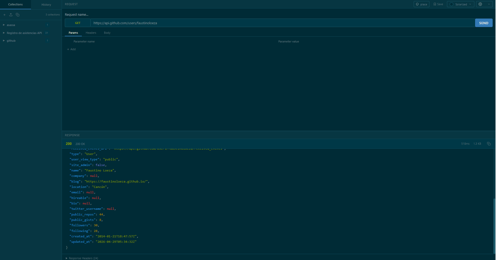

# API Kit

A native desktop HTTP client for testing REST APIs. Build, send, and inspect HTTP requests with a clean, modern interface — similar to Postman or Insomnia, but lightweight and compiled to a single executable.

<p align="center">
  
</p>

## Features

- **Full HTTP method support** — GET, POST, PUT, PATCH, DELETE, HEAD, OPTIONS
- **Request builder** — Headers, query params, JSON body, form-data, and URL-encoded bodies
- **Syntax-highlighted responses** — JSON responses are colorized (keys, strings, numbers, booleans, null)
- **Collections** — Organize requests into named collections, save and reuse them
- **History** — Every request is logged with its response for later review
- **Environments** — Manage sets of variables (e.g. `{{base_url}}`, `{{token}}`) and switch between them
- **Import** — Paste or load Postman JSON collections
- **Themes** — Dark, Light, Solarized, One Dark Pro, Monokai
- **Configurable font size** — Small, Normal, Large, Extra Large
- **Copy to clipboard** — One-click copy of response body
- **Auto-update** — Checks for new versions and downloads the latest installer

## Tech Stack

| Layer | Technology |
|-------|-----------|
| Desktop Framework | [Wails v2](https://wails.io/) |
| Backend | Go |
| Frontend | React + TypeScript |
| Styling | Tailwind CSS |
| Bundler | Vite |
| WebView | WebView2 (Windows) |

## Development

```bash
# Install dependencies
cd frontend && npm install && cd ..

# Run in live development mode (hot reload)
wails dev

# Build production executable
build.bat
```

## Building

Run `build.bat` — it reads `version.txt`, syncs the version to `wails.json`, and runs `wails build`. The output executable will be in `build/bin/`.

To publish a new release:
1. Update the version in `version.txt`
2. Run `build.bat`
3. Upload the `.exe` to your release channel
4. Update `version.txt` on the release server so auto-update picks it up
